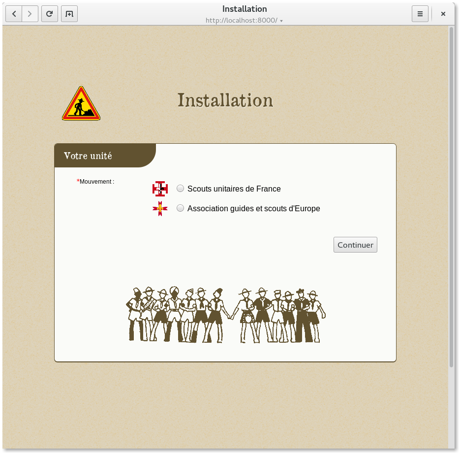

========================
 Le local scout virtuel
========================

.. image:: https://circleci.com/gh/bersace/strass.svg?style=shield
   :target: https://circleci.com/gh/bersace/strass
   :alt: Intégration continue

Strass est un projet de moteur de site scout initié en 2007. Il s'adresse aux
unités scout des associations SUF et FSE, suivant la pédagogie unitaire.

Fonctionnalités
===============

- CV scout de chacun ;
- Effectifs des unités ;
- Calendrier d'unité, avec héritage du calendrier de l'unité parente ;
- Page de documents : fiche d'inscription, fiche sanitaire, etc. ;
- Album photos par activité ;
- Blog d'unité ;
- Citations, livre d'or, page de liens, archives, etc. ;
- Assistant d'installation.

Tester
======

Sur système debian ::

  sudo apt install -y sqlite3
  git clone https://github.com/bersace/strass.git
  cd strass/
  mkvirtualenv --python=python3 strass
  make setup all
  docker-compose up

Ensuite, suivre l'assistant à l'adresse http://strass.docker:8000 . Voir make
help pour plus de possibilités.
